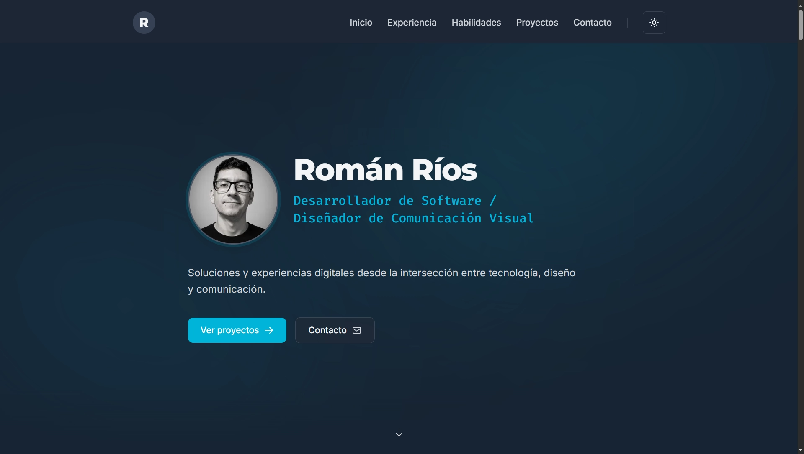

<div align="center">

# romanrios.com.ar

Sitio web personal y plataforma para exhibir proyectos, trayectoria y habilidades técnicas.

<br />

[](https://nextjs.org/)
[](https://react.dev/)
[](https://www.typescriptlang.org/)
[](https://tailwindcss.com/)
[](https://turso.tech/)
[](https://orm.drizzle.team/)
[](https://authjs.dev/)
[](https://cloudinary.com/)
[](https://resend.com/)
[](https://vercel.com/)

<br />
<br />



</div>

---

## Descripción

Portafolio profesional de Román Ríos. La aplicación combina una sección pública para la presentación de trabajos y trayectoria con un panel de administración privado (CMS) para gestionar los contenidos de forma dinámica.

---

## Funcionalidades

- **Modo oscuro y claro**: Selector de tema con detección de preferencias del sistema y persistencia local.
- **Catálogo de proyectos**: Listado dinámico de proyectos con etiquetas de tecnologías y enlaces a repositorios y aplicaciones en producción.
- **Línea de tiempo**: Visualización cronológica de experiencia laboral y formación académica con filtros por área.
- **Habilidades técnicas**: Listado estructurado de tecnologías y competencias por categoría.
- **Formulario de contacto**: Envío de mensajes vía Resend con protección anti-spam (*honeypot*) y límite de peticiones (*rate limiting*) por IP.
- **Panel de administración (`/admin`)**: CMS protegido por Google OAuth para crear, editar y eliminar información del perfil, proyectos, experiencias, habilidades, imágenes y configuración general.
- **Gestión multimedia**: Subida, visualización y eliminación de imágenes integradas con Cloudinary.
- **SEO y accesibilidad**: Metadatos OpenGraph, sitemap, robots y datos estructurados Schema.org (JSON-LD).

---

## Stack Tecnológico

| Componente | Tecnología |
| :--- | :--- |
| **Frontend** | Next.js 16 (App Router), React 19, TypeScript, Tailwind CSS v4 |
| **Base de datos y ORM** | Turso (LibSQL), Drizzle ORM |
| **Autenticación** | Auth.js v5 (Google OAuth) |
| **Servicios externos** | Cloudinary (imágenes), Resend (emails transaccionales) |
| **Despliegue** | Vercel |

---

## Estructura del Proyecto

```text
mi-sitio-web/
├── app/          # Rutas, páginas y endpoints de la API (App Router)
├── components/   # Componentes visuales reutilizables (layout, tema, UI)
├── content/      # Textos base y configuración editorial
├── features/     # Módulos por dominio (proyectos, experiencia, contacto, admin)
└── lib/          # Utilidades y configuración de clientes
```

---

## Desarrollo Local

1. **Instalación:**
   ```bash
   git clone https://github.com/romanrios/mi-sitio-web.git
   cd mi-sitio-web
   npm install
   ```

2. **Variables de entorno (`.env.local`):**
   ```env
   TURSO_DATABASE_URL=
   TURSO_AUTH_TOKEN=
   AUTH_SECRET=
   AUTH_GOOGLE_ID=
   AUTH_GOOGLE_SECRET=
   ADMIN_EMAILS="correo@ejemplo.com"
   RESEND_API_KEY=
   CLOUDINARY_CLOUD_NAME=
   CLOUDINARY_API_KEY=
   CLOUDINARY_API_SECRET=
   ```

3. **Ejecución:**
   ```bash
   npx drizzle-kit push   # sincronizar esquema
   npm run dev            # iniciar en http://localhost:3000 (panel en /admin)
   ```

---

## Contacto

- **Sitio Web:** [romanrios.com.ar](https://romanrios.com.ar)
- **LinkedIn:** [linkedin.com/in/romanrios](https://linkedin.com/in/romanrios)
- **GitHub:** [github.com/romanrios](https://github.com/romanrios)
- **Email:** [romanrios@live.com](mailto:romanrios@live.com)
